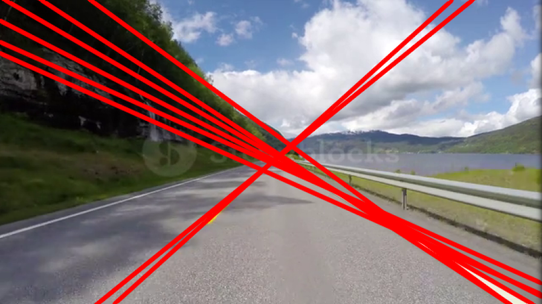
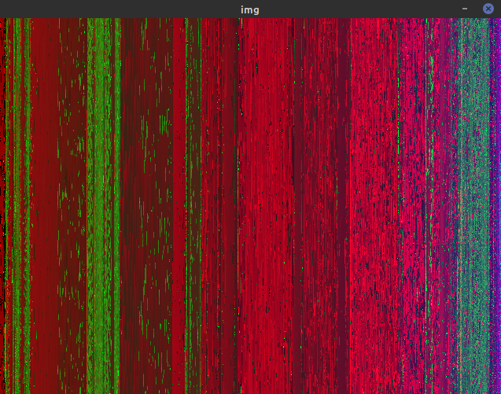

# cpp-training
This is the place where lines will be practiced!

## opencv-01
In diesem OpenCV-Projekt widme ich mich der Erkennung von Fahrbahnmarkierungen.
Dazu orientiere ich mich an einem [Artikel](https://medium.com/@mrhwick/simple-lane-detection-with-opencv-bfeb6ae54ec0) 
auf Medium.
Da der Autor seinen Code in python schreibt muss ich diesen noch in c++ übersetzen.

<!---->

  

## opencv-02
In diesem OpenCV-Projekt widme ich mich der Sortierung von Farbwerten in Bildern.

<!---->

  

